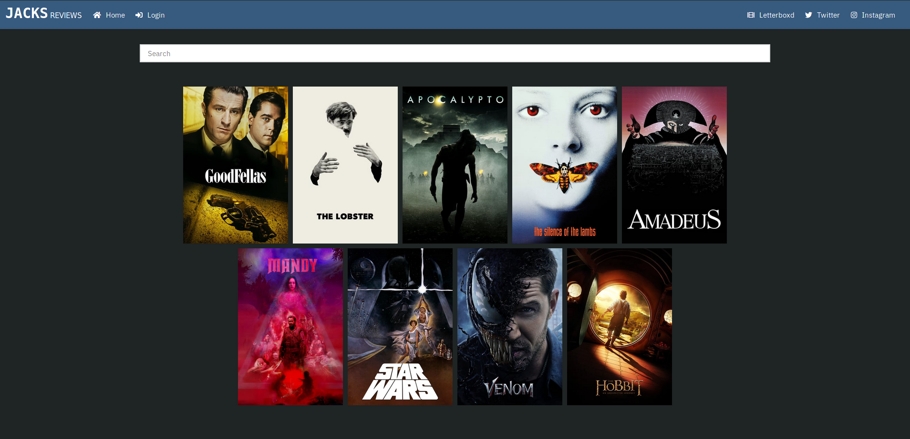
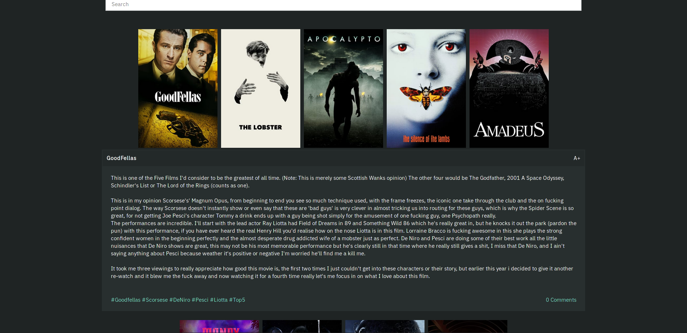

# jacks.reviews

## Project setup

### API Setup with Docker
```
# Clone
git clone git@github.com:danstewart/jacks.reviews.git
cd jacks.reviews

# Populate master.key
echo "KEY" > api/config/master.key

# Start containers
export MYSQL_ROOT_PASSWORD=<password>
docker-compose up -d

# Populate databases (First time only)
docker-compose run app rake db:create db:migrate db:seed

# Import data from .sql
docker exec -i jacksreviews_db_1 sh -c 'exec mysql -uroot -p$0 prod/jacksreviews' $MYSQL_ROOT_PASSWORD < jacksreviews.prod.sql
```

### Frontend Setup
```
cd ./frontend

# install deps and build
npm install
npm run build

# link to web dir
sudo ln -s $(pwd)/dist/ /data/www/jacks.reviews
```

### nginx
```
sudo cp nginx/{api.,}jacks.reviews /etc/nginx/sites-available
sudo ln -s /etc/nginx/sites-available/jacks.reviews /etc/nginx/sites-enabled/
sudo ln -s /etc/nginx/sites-available/api.jacks.reviews /etc/nginx/sites-enabled/

sudo systemctl restart nginx
```

### Certbot
```
sudo certbot --nginx
```

---

## Screenshots


